# DSO101 - Assignment 1
## Continuous Integration and Continuous Deployment

**Name:** Pema Dolker  
**Student Number:** 02230294  
**Course:** DSO101 - Continuous Integration and Continuous Deployment  
**GitHub Repository:** https://github.com/pemadolker/Pemadolker_02230294_DSO101_A1  
**Date of Submission:** 15th March 2026

---


## Assignment Overview

This assignment involved building a full-stack Todo List web application and deploying it using Docker and Render.com. The app supports adding, editing, deleting, and completing tasks with priority levels and search/filter functionality.

The assignment was split into three parts:
- **Step 0:** Build the actual todo app with a working frontend, backend, and database
- **Part A:** Manually build Docker images, push them to Docker Hub, and deploy on Render using those pre-built images
- **Part B:** Connect Render directly to the GitHub repository so every `git push` automatically builds and deploys a new Docker image

**Live URLs:**
- Frontend: https://fe-todo-02230294.onrender.com
- Backend API: https://be-todo-02230294.onrender.com

---

## Tech Stack

| Layer | Technology |
|-------|-----------|
| Frontend | React 18 |
| Backend | Node.js, Express.js |
| Database | PostgreSQL  |
| Containerization | Docker |
| Local Orchestration | Docker Compose |
| Image Registry | Docker Hub |
| Hosting | Render.com |
| Version Control | Git, GitHub |

---

## Project Structure

```
Pemadolker_02230294_DSO101_A1/
└── A1/
    └── todo-app/
        ├── frontend/
        │   ├── src/
        │   │   ├── App.js         # Main React component - all CRUD UI
        │   │   ├── App.css        # Styling
        │   │   ├── api.js         # API helper functions (fetch, create, update, delete)
        │   │   ├── index.js       # React entry point
        │   │   └── index.css      # Global styles
        │   ├── public/
        │   │   └── index.html
        │   ├── Dockerfile         # node:18-alpine, runs npm start
        │   └── .env
        │
        ├── backend/
        │   ├── server.js          # Express API with full CRUD endpoints
        │   ├── package.json
        │   ├── Dockerfile         # node:18-alpine
        │   └── .env
        │
        ├── render.yaml            # Render Blueprint config (Part B reference)
        ├── .gitignore             # .env files never committed
        └── README.md
```

---

## Step 0 - Building the Todo App

### What the App Does

The todo app is a full-stack web application where you can:
-  Add new tasks with a title, description, and priority (low, medium, high)
-  Edit existing tasks
-  Delete tasks
-  Mark tasks as complete/incomplete
-  Search tasks by title or description
-  Filter by All, Active, or Completed
- Sort by Newest, Oldest, or Priority

### Backend API (Express + Node.js)

The backend runs on port 5000 and exposes these endpoints:

| Method | Route | Description |
|--------|-------|-------------|
| GET | /health | Health check |
| GET | /api/todos | Get all todos |
| GET | /api/todos/:id | Get single todo |
| POST | /api/todos | Create new todo |
| PUT | /api/todos/:id | Update todo |
| DELETE | /api/todos/:id | Delete todo |

The database table is automatically created when the backend starts using `CREATE TABLE IF NOT EXISTS`, so there is no need to manually set up the schema.

### Database (PostgreSQL)

The todos table has the following columns:
- `id` - auto-incrementing primary key
- `title` - task title (required)
- `description` - optional details
- `completed` - boolean, defaults to false
- `priority` - low, medium, or high
- `created_at` and `updated_at` - timestamps

### Environment Variables

Environment variables were used throughout to keep credentials out of the codebase. The `.env` files are listed in `.gitignore` and were never committed to GitHub.

**Backend `.env` (local only):**
```
DB_HOST=localhost
DB_USER=postgres
DB_PASSWORD=postgres
DB_NAME=tododb
DB_PORT=5432
DB_SSL=false
PORT=5000
```

**Frontend `.env` (local only):**
```
REACT_APP_API_URL=http://localhost:5000
```

>  These files are only for local development. On Render, all environment variables are set directly in the dashboard and never stored in files.

### Running Locally


# Backend
cd backend
touch .env   # fill in values
npm install
npm start              # runs on http://localhost:5000

# Frontend (new terminal)
cd frontend
cd .env   # REACT_APP_API_URL=http://localhost:5000
npm install
npm start              # runs on http://localhost:3000
```

**Option 2 - With Docker Compose:**
```bash
docker-compose up --build
# Frontend: http://localhost:3000
# Backend:  http://localhost:5000
```

Both were tested and worked locally before moving to deployment.


---

## Part A - Deploying Pre-built Docker Image to Docker Hub and Render

In Part A, the idea is to manually build the Docker images on your own machine, push them to Docker Hub with the student ID as the tag, and then tell Render to pull and run those exact images.

### Step A1 - Build and Push Images to Docker Hub

Log in to Docker Hub:
```bash
docker login
```

**Build and push the Backend image:**
```bash
cd backend
docker build -t pdolker/be-todo:02230294 .
docker push pdolker/be-todo:02230294
```

**Build and push the Frontend image:**
```bash
cd frontend
docker build -t pdolker/fe-todo:02230294 .
docker push pdolker/fe-todo:02230294
```

The student ID `02230294` was used as the image tag as required by the assignment.


---

### Step A2 - Set Up PostgreSQL on Render

1. Render Dashboard → **New +** → **PostgreSQL**
2. Name: `todo-db`, Region: Singapore, Plan: Free
3. Click **Create Database**
4. Once available, go to the database → **Connections** section
5. Copy the Host, Username, Password, and Database name

>  The database name Render generates is not just `tododb` — it has extra characters. Always copy it exactly from the dashboard, never type it manually.

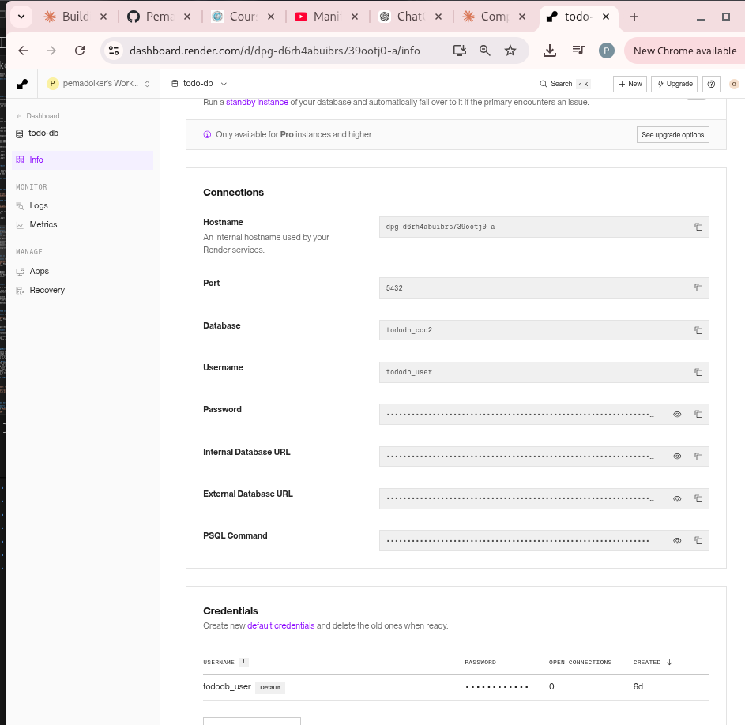

---

### Step A3 - Deploy Backend on Render (Pre-built Image)

1. **New +** → **Web Service** → **"Deploy an existing image from a registry"**
2. Image URL: `docker.io/pdolker/be-todo:02230294`
3. Name: `be-todo-02230294`, Region: Singapore, Plan: Free
4. Add Environment Variables:

| Key | Value |
|-----|-------|
| DB_HOST | (copied from Render PostgreSQL dashboard) |
| DB_USER | (copied from Render PostgreSQL dashboard) |
| DB_PASSWORD | (copied from Render PostgreSQL dashboard) |
| DB_NAME | (copied from Render PostgreSQL dashboard) |
| DB_PORT | 5432 |
| DB_SSL | true |
| PORT | 5000 |

5. Click **Create Web Service**

The backend logs confirmed it was working:
```
Backend server running on port 5000
Database initialized successfully
```

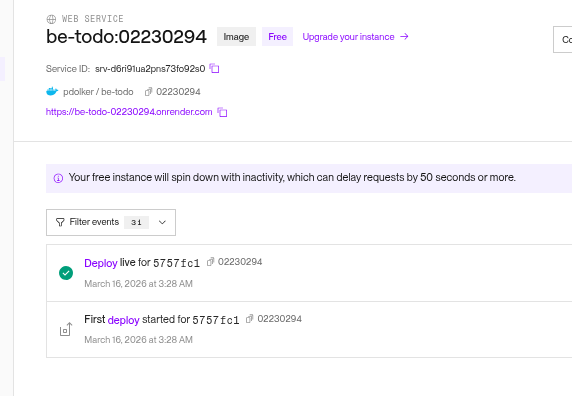

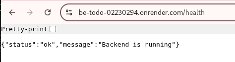

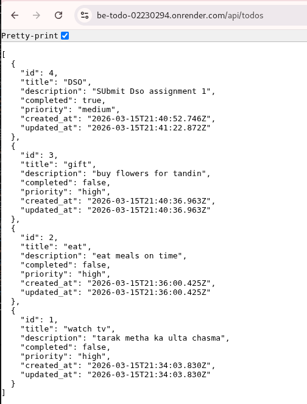
---

### Step A4 - Deploy Frontend on Render (Pre-built Image)

1. **New +** → **Web Service** → **"Deploy an existing image from a registry"**
2. Image URL: `docker.io/pdolker/fe-todo:02230294`
3. Name: `fe-todo-02230294`, Region: Singapore, Plan: Free
4. Add Environment Variable:

| Key | Value |
|-----|-------|
| REACT_APP_API_URL | https://be-todo-02230294.onrender.com |

5. Click **Create Web Service**

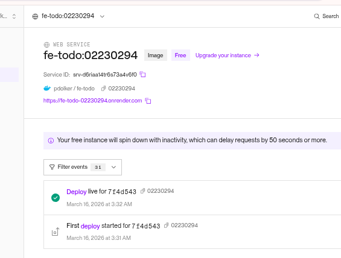

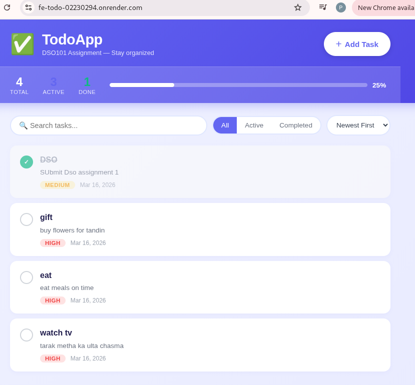


---


## Part B - Automated Image Build and Deployment from GitHub

In Part B, instead of manually building and pushing images, Render builds the Docker image directly from the GitHub repository every time a new commit is pushed to the `main` branch. This is what makes it proper CI/CD — the deployment is fully automated without any manual steps.

> **Note on render.yaml / Blueprint:** The Render Blueprint feature requires a paid plan and does not work on the free tier. For this assignment, the same automated CI/CD behavior was achieved by connecting Render services directly to the GitHub repository. Render still rebuilds and redeploys on every `git push` to `main`, which fully satisfies the core requirement of the assignment. The `render.yaml` file is included in the repository to demonstrate understanding of the Blueprint specification.

### Step B1 - Push Code to GitHub

```bash
cd ~/DSO101/A1/todo-app
git init
git add .
git commit -m "initial commit: todo app DSO101 A1"
git branch -M main
git remote add origin https://github.com/pemadolker/Pemadolker_02230294_DSO101_A1.git
git push -u origin main
```

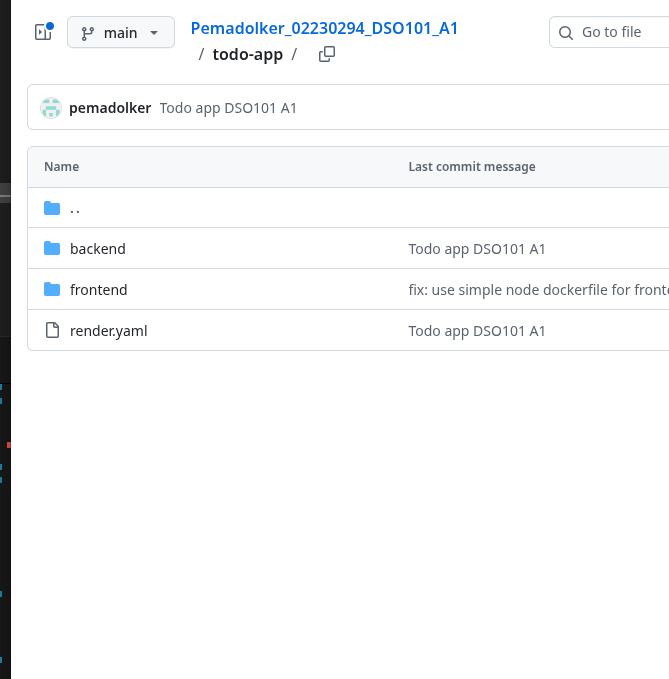
---

### Step B2 - Create Backend Service from GitHub

1. Render Dashboard → **New +** → **Web Service**
2. Select **"Build and deploy from a Git repository"**
3. Connect GitHub → select `Pemadolker_02230294_DSO101_A1`
4. Settings:
   - Name: `be-todo-02230294`
   - Region: Singapore
   - Branch: `main`
   - Root Directory: `todo-app/backend`
   - Environment: `Docker`
   - Dockerfile Path: `./Dockerfile`
   - Plan: Free
5. Add the same environment variables as Part A
6. Click **Create Web Service**

Render pulls the code from GitHub and builds the Docker image using the `backend/Dockerfile` automatically.

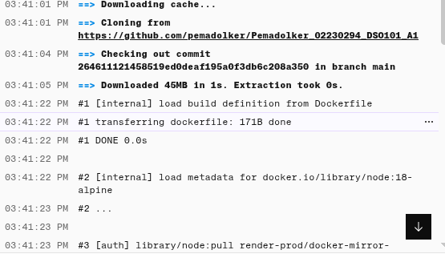

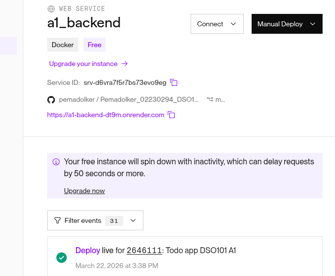
---

### Step B3 - Create Frontend Service from GitHub

Live app working at https://a1-frontend-j9q5.onrender.com

1. Render Dashboard → **New +** → **Web Service**
2. Select **"Build and deploy from a Git repository"**
3. Select the same repo
4. Settings:
   - Name: `fe-todo-02230294`
   - Region: Singapore
   - Branch: `main`
   - Root Directory: `todo-app/frontend`
   - Environment: `Docker`
   - Dockerfile Path: `./Dockerfile`
   - Plan: Free
5. Add Environment Variable:

| Key | Value |
|-----|-------|
| REACT_APP_API_URL | https://be-todo-02230294.onrender.com |

6. Click **Create Web Service**

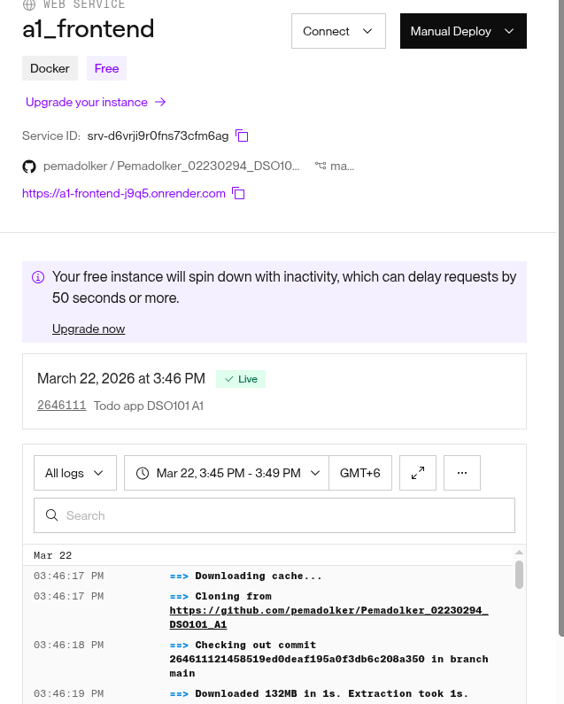

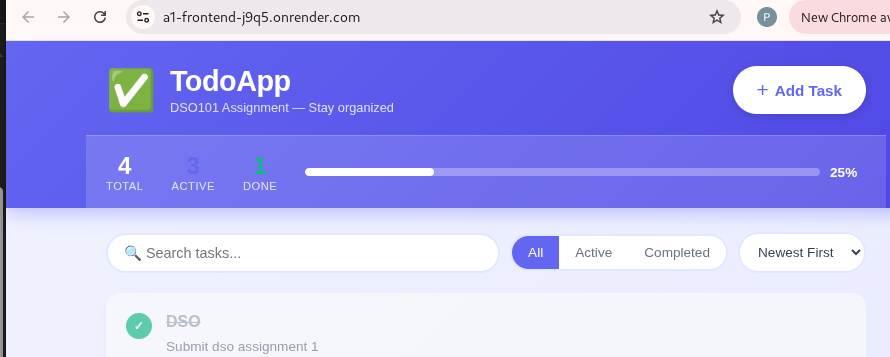
 
---

### Step B4 - Verify Auto-Deploy on Git Push

To confirm that auto-deploy is working, a small change was pushed to GitHub:

```bash
git add .
git commit -m "test: trigger auto deploy verification"
git push origin main
```

After the push, Render automatically detected the new commit and started rebuilding both services without any manual action needed.

> 📸 Screenshot: Render dashboard showing "Deploy in progress" automatically triggered by git push
> 📸 Screenshot: Deploy logs showing new Docker image being built from the updated code
> 📸 Screenshot: Both services back to "Live" after auto-deploy completes

---

## What I Learned

This assignment taught me a lot more than I expected. Going in I thought Docker was just something complicated that bigger companies use, but after going through all of this I actually get why it exists and why it matters.

**Environment Variables** — Before this I would probably just hardcode database passwords directly in the code without thinking much about it. Now I understand why that is dangerous, especially when the code is public on GitHub. Using `.env` files locally and setting variables directly in Render's dashboard for production is the right way to do it. The fact that `.env` is in `.gitignore` and never gets committed was something I had to be careful about the whole time.

**Docker and Images** — Writing a Dockerfile, building an image, tagging it with a version (student ID in this case), and pushing it to Docker Hub all made sense once I actually did it. The concept of image layers also clicked — why it says "Layer already exists" during push and how that saves time by not re-uploading things that haven't changed.

**Part A vs Part B difference** — This was the most important thing to understand in the whole assignment. In Part A I was doing everything manually — build image on laptop, push to Docker Hub, then Render just runs it. That means if I make a change and forget to rebuild and push, the live app is still running the old version. In Part B, Render does all of that automatically the moment I push code to GitHub. That is what CI/CD actually means in real life.

**Debugging on Render** — A lot of things broke along the way. The `nginx.conf` had a `proxy_pass` pointing to `be-todo` which works in Docker Compose locally because the containers can find each other by name, but breaks on Render because there is no container network like that. The database name was not just `tododb` but had extra characters Render generates automatically. Reading logs carefully and not just assuming the code was wrong saved a lot of time.

**render.yaml** — Even though Blueprint does not work on the free tier, writing the file and understanding what each line does was useful. It is basically a `docker-compose.yml` but for Render, describing all services and how they connect.

---